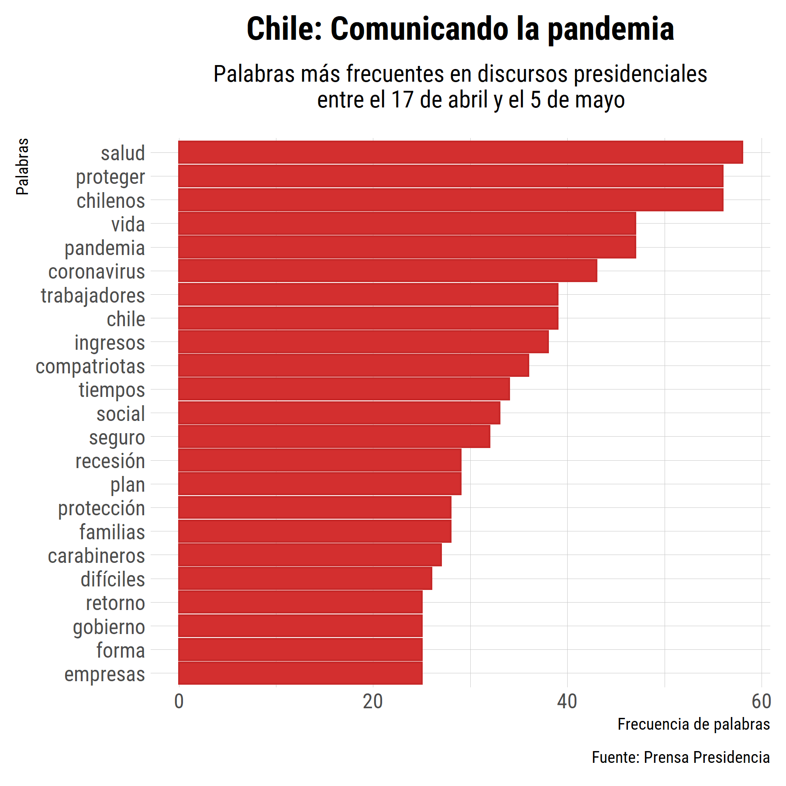
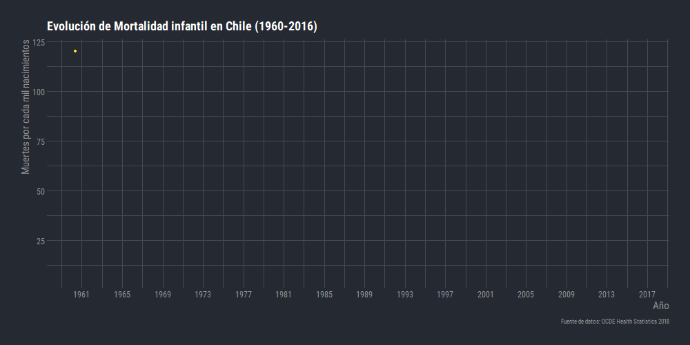
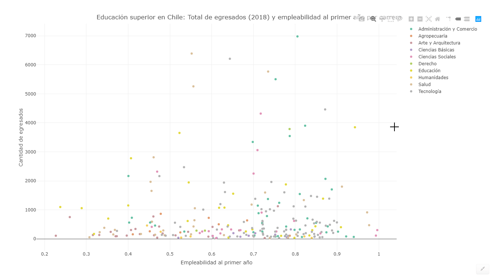

# *#30díasdegráficos* con R
Contribuciones a la iniciativa de [@R4DS_es](https://twitter.com/R4DS_es) en conmemoración al nacimiento de Florence Nightingale. Para mayor infomración visitar [Ciencia de Datos](https://github.com/cienciadedatos/datos-de-miercoles/blob/master/30-dias-de-graficos-2020.md).

## Día 1: Gráfico de barras/columnas
* [Código](https://github.com/islaskip/30_dias_de_graficos/blob/master/codigo/2020_05_12_discursos_presidenciales.R)

## Día 2: Gráfico de linea
* [Código](https://github.com/islaskip/30_dias_de_graficos/blob/master/codigo/2020_05_13_mortalidad_infantil.R)

## Día 3: Gráfico de puntos
* [Código](https://github.com/islaskip/30_dias_de_graficos/blob/master/codigo/2020_05_14_educacion_superior.R) 
* [Fuente de datos](https://www.mifuturo.cl/mi-futuro-buscadores/) 
* [Gráfico interactivo](https://rpubs.com/matiasisla/614587)

