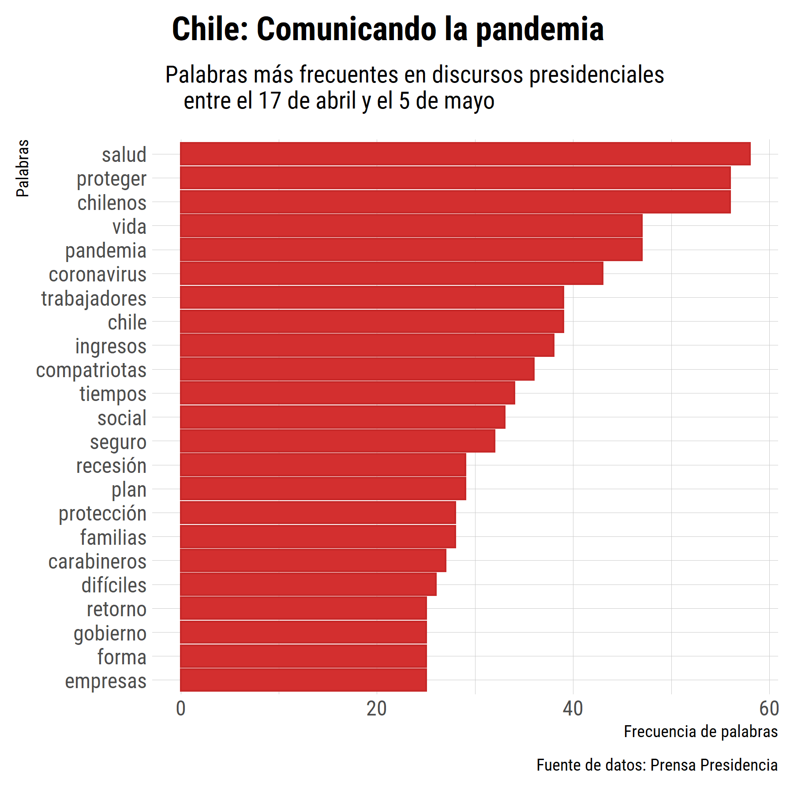

# *#30díasdegráficos* con R
Contribuciones a la iniciativa de [@R4DS_es](https://twitter.com/R4DS_es) en conmemoración al nacimiento de Florence Nightingale. Para mayor infomración visitar [Ciencia de Datos](https://github.com/cienciadedatos/datos-de-miercoles/blob/master/30-dias-de-graficos-2020.md).

## Día 1: Gráfico de barras/columnas
* [Código](https://github.com/islaskip/30_dias_de_graficos/blob/master/codigo/2020_05_12_discursos_presidenciales.R)

